# AWS CDK Node.js App with GitHub Actions

[](https://github.com/victor-langlois/demo-cdk-ecs-github_actions/actions/workflows/dev.yaml)

## 📢 Recent Updates

The project documentation has been significantly enhanced:

- **Expanded workflow documentation**: Added detailed troubleshooting guides, performance considerations, and integration information
- **Improved inline comments**: Added comprehensive comments to GitHub Actions workflows
- **New workflow change log**: Created `docs/workflow-changes.md` to track workflow modifications

## Overview

This project is a Node.js application deployed to AWS ECS using AWS CDK. It demonstrates a basic CI/CD pipeline using GitHub Actions for continuous integration, Docker for containerization, and AWS CDK for infrastructure as code.

## Prerequisites

### IAM Role for GitHub Actions

Create an IAM role in the AWS Management Console that GitHub Actions can assume when deploying resources (Ex: `github-actions-role`).
Note the Role ARN; you will use it as a variable in the GitHub repository.

### GitHub Repository Vars (or Secrets)

In your GitHub repository, add the following secrets:

- `APPLICATION_ID`: Your internal application id.
- `AWS_ACCOUNT_ID`: Your AWS account id.
- `AWS_REGION`: The AWS region where your ECS cluster is located.
- `AWS_ROLE`: The ARN of the IAM role created for GitHub Actions.

### IAM Trust Relationship

Ensure the IAM role created has a trust relationship with GitHub Actions. This can be done by updating the trust policy with the GitHub Actions account ID.

1. In the IAM console, select the IAM role created for GitHub Actions.

2. Under the "Trust relationships" tab, click "Edit trust relationship."

3. Update the JSON document with the GitHub Actions account ID:

   ```json
   {
     "Version": "2012-10-17",
     "Statement": [
       {
         "Effect": "Allow",
         "Principal": {
           "Federated": "arn:aws:iam::<account-id>:oidc-provider/token.actions.githubusercontent.com"
         },
         "Action": "sts:AssumeRoleWithWebIdentity",
         "Condition": {
           "StringLike": {
             "token.actions.githubusercontent.com:sub": "repo:<github-username>/<github-repo>:*",
             "token.actions.githubusercontent.com:aud": "sts.amazonaws.com"
           }
         }
       }
     ]
   }
   ```

4. Follow [these steps](https://docs.aws.amazon.com/IAM/latest/UserGuide/id_roles_providers_create_oidc.html) to add the GitHub OIDC provider to IAM. For the provider URL: Use <https://token.actions.githubusercontent.com> and use `sts.amazonaws.com` for the "Audience" if you are using the [official action](https://github.com/aws-actions/configure-aws-credentials).

## Project Structure

```
├── src/              # Source code
├── infra/            # AWS CDK scripts for defining infrastructure
├── Dockerfile        # Docker configuration for containerizing the source code
├── .github/workflows # GitHub Actions workflow configuration
├── ...
```

- src: Contains the Node.js application logic.
- infra: Contains AWS CDK scripts for defining infrastructure.
- Dockerfile: Docker configuration for containerizing the source code.
- .github/workflows: Contains GitHub Actions workflow configuration.

## Feature: Branch-Based Environments

This project supports two ways to work with branch environments:

1. **Complete Branch Environment Deployment**: Create a fully isolated infrastructure for each branch
2. **Application-Only Deployment**: Deploy just a new application version to an existing environment

These options give you flexibility in your development and testing workflows.

### Option 1: Complete Branch Environment (Infrastructure + App)

When you need a fully isolated environment with its own infrastructure:

- **Use case**: Feature development requiring infrastructure changes, major version testing
- **Resources created**: IAM roles, ECR repository, ECS service, Load Balancer, etc.
- **Workflow**: `Branch Environment Deployment`

#### How It Works

1. **Creating a Complete Branch Environment**:
   - When you create and push a new branch, GitHub Actions automatically:
     - Creates branch-specific infrastructure (IAM roles, ECR repository, ECS service)
     - Builds and deploys your application to this isolated environment
     - Uses branch name as part of resource identifiers

2. **Accessing Branch Environments**:
   - Each branch gets its own load balancer URL
   - The URL will be shown in the GitHub Actions workflow output

3. **Cleaning Up**:
   - When you delete a branch, resources are automatically cleaned up
   - You can also manually trigger cleanup via the GitHub Actions UI

### Option 2: Application-Only Deployment

When you just need to update the application code without changing infrastructure:

- **Use case**: Rapid iteration, bug fixes, content updates
- **Resources updated**: Only the Docker container image and ECS task definition
- **Workflow**: `App-Only Deployment`

#### How It Works

1. The workflow checks if the specified environment exists
2. Builds and pushes a new Docker image to the existing ECR repository
3. Updates the ECS service with the new image without changing infrastructure

This is much faster than a full deployment and doesn't require infrastructure changes.

### Manual Deployment/Cleanup

You can manually trigger any of these workflows:

1. Go to the "Actions" tab in your GitHub repository
2. Select the desired workflow:
   - `Branch Environment Deployment`: For full infrastructure + app
   - `App-Only Deployment`: For just updating the application
   - `Branch Environment Cleanup`: For removing an environment
   - `🚀 Déployer une application`: User-friendly interface for non-technical users
3. Click "Run workflow"
4. Enter the branch/environment name when prompted

#### User-Friendly Deployment Interface

For team members who are less familiar with GitHub and technical details, we've created a simplified deployment interface:

1. Go to the "Actions" tab in your GitHub repository
2. Select the `🚀 Déployer une application` workflow
3. Click "Run workflow"
4. Choose your deployment options:
   - Type: Choose between application-only (fast) or complete environment
   - Branch: Enter the branch name to deploy
   - Environment: (Optional) Use a custom environment name
5. Click "Run workflow" again to start the deployment

This simplified interface handles all the technical details behind the scenes and provides clear status updates.

### Best Practices

- Use descriptive, short branch names (they're used in AWS resource names)
- Delete branches when no longer needed to avoid unnecessary AWS costs
- Limit concurrent branches to control AWS resource usage

## Customization

### Changing Source Code

The source code is located in the src/ directory. Customize the Node.js application logic to meet your specific requirements.

### Adapting Dockerfile

The Dockerfile (Dockerfile) in the root directory defines the configuration for containerizing your source code. Modify the Dockerfile as needed to ensure compatibility with your application.

### Customizing AWS CDK Scripts

The AWS CDK scripts are located in the infra directory. Customize the scripts in infra to define your AWS infrastructure according to your requirements.

## Deployment Process Visualization

Here's a high-level overview of the deployment process:


More detailed diagrams for specific workflows are provided below.

### Branch Environment Deployment Workflow

This diagram illustrates the process of creating a complete branch environment, including both infrastructure and application deployment.


### App-Only Deployment Workflow

This diagram shows the process for deploying only the application to an existing environment.


### Branch Environment Cleanup Workflow

This diagram outlines the process for cleaning up and deleting a branch environment.


### User-Friendly Deployment Interface (`🚀 Déployer une application`)

This diagram illustrates the simplified deployment interface workflow, which allows users to choose between a full environment deployment or an application-only update.

```mermaid
sequenceDiagram
    participant User
    participant GitHubUI as GitHub Actions UI
    participant DeployerWorkflow as "🚀 Déployer une application Workflow"
    participant BranchEnvWorkflow as "Branch Environment Deployment Workflow"
    participant AppOnlyWorkflow as "App-Only Deployment Workflow"

    User->>GitHubUI: Navigate to Actions tab
    User->>GitHubUI: Select "🚀 Déployer une application" workflow
    User->>GitHubUI: Click "Run workflow"
    GitHubUI->>DeployerWorkflow: Initiate with user inputs
    DeployerWorkflow->>DeployerWorkflow: User provides inputs:
    Note right of DeployerWorkflow: - Type (Complete Environment / App-Only)
    Note right of DeployerWorkflow: - Branch Name
    Note right of DeployerWorkflow: - Environment Name (optional)

    alt User chooses "Complete Environment"
        DeployerWorkflow->>BranchEnvWorkflow: Trigger with branch & environment name
        BranchEnvWorkflow-->>DeployerWorkflow: Report status
        Note left of BranchEnvWorkflow: (Executes full sequence: 
        Note left of BranchEnvWorkflow: CDK Infra Provisioning, 
        Note left of BranchEnvWorkflow: Docker Build & Push, 
        Note left of BranchEnvWorkflow: ECS Deployment)
    else User chooses "App-Only"
        DeployerWorkflow->>AppOnlyWorkflow: Trigger with branch & environment name
        AppOnlyWorkflow-->>DeployerWorkflow: Report status
        Note left of AppOnlyWorkflow: (Executes app update sequence: 
        Note left of AppOnlyWorkflow: Docker Build & Push, 
        Note left of AppOnlyWorkflow: ECS Service Update)
    end

    DeployerWorkflow->>GitHubUI: Display overall status and results to user
```



And here's a top-down graph view of the same user-friendly workflow:

```mermaid
graph TD
    A[User Initiates<br>🚀 Déployer une application] --> B{User Selects Deployment Type};
    B -- Choice: Complete Environment --> C[Trigger: Branch Environment Deployment Workflow];
    C --> D["CDK: Provisions Full Infrastructure<br>(VPC, ECR, ECS Cluster, Service, LB, IAM)"];
    D --> E[GitHub Actions: Builds & Pushes Docker Image];
    E --> F[CDK: Deploys Application to New ECS Service];

    B -- Choice: App-Only --> G[Trigger: App-Only Deployment Workflow];
    G --> H[CDK: Verifies Existing Infrastructure];
    H --> I[GitHub Actions: Builds & Pushes Docker Image];
    I --> J[CDK: Updates Existing ECS Service with New Image];

    F --> K[Deployment Complete];
    J --> K;
```



### Detailed Workflow: Branch Environment Deployment (graph TD)

This graph provides a more detailed breakdown of the `Branch Environment Deployment` workflow, illustrating the key stages from triggering the workflow to a live, branch-specific environment.


